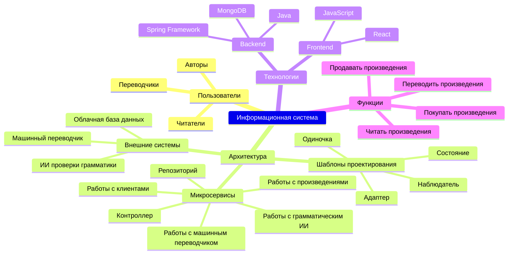
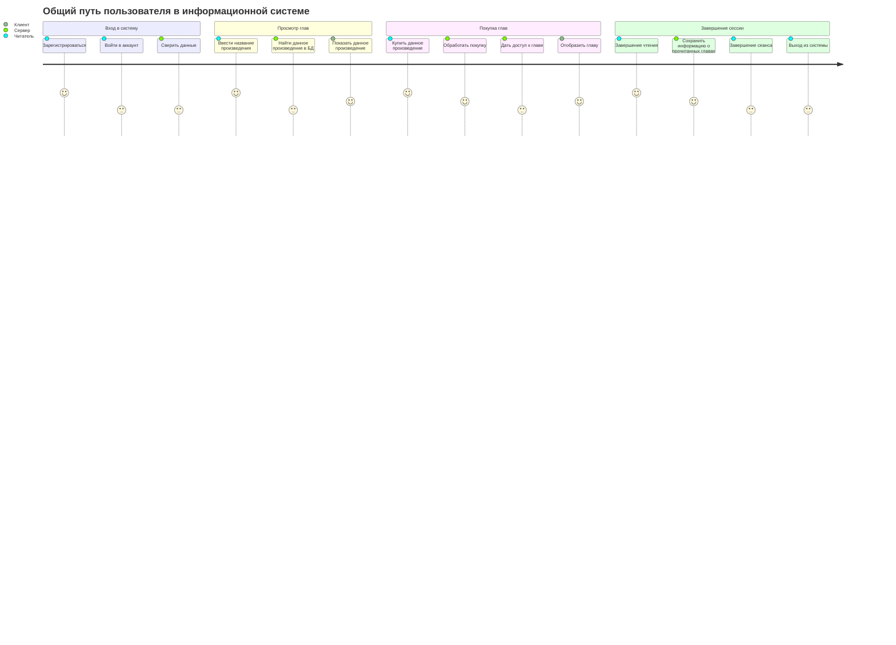
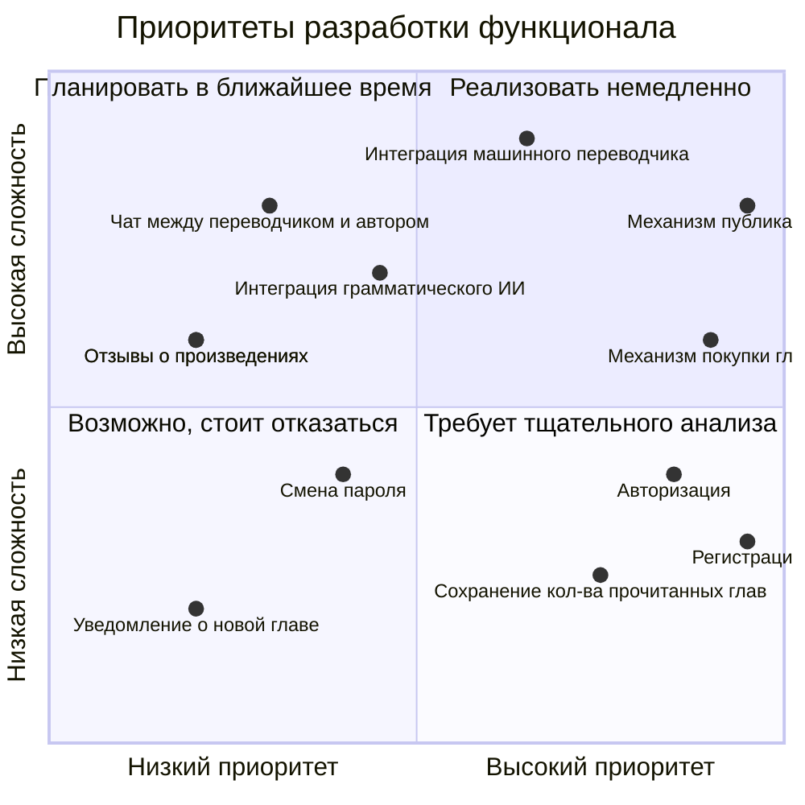
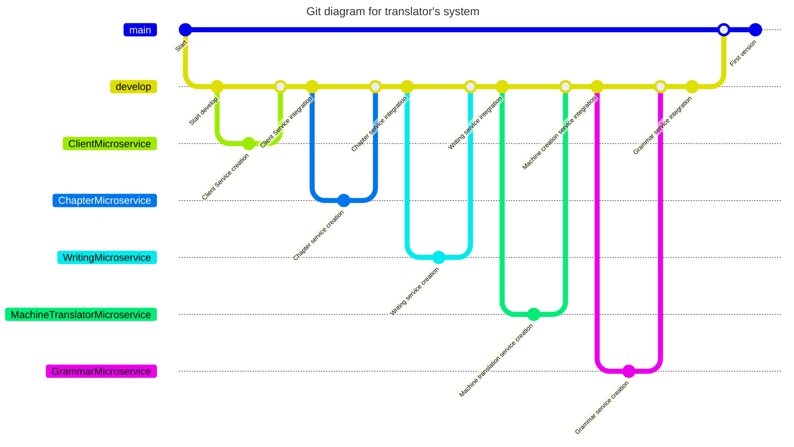

# PKSSPractice12

## Mindmap

Здесь представлены ключевые особенности нашей информационной системы

## User Journey Diagram

Здесь представлен путь пользователя

## Квадрант-граф

Здесь представлен квадрант-граф

## GitGraph

Так выглядит наш примерный путь коммитов

